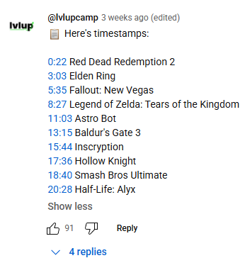

# YouTube Timestamp Extractor

A Python script that automatically extracts and posts timestamps with game titles from YouTube videos, specifically designed for Gameranx.

## 🎯 The Problem

Have you ever watched a YouTube video with timestamps but couldn't see the actual game titles? Many gaming channels post videos with timestamps like "00:30 - Number 1" or "02:15 - Number 2" without revealing what games they're actually talking about. This script solves that problem by:

1. **Automatically detecting** when a video contains a "Top X" format
2. **Extracting timestamps** from the video description or transcript
3. **Identifying game titles** using AI analysis
4. **Posting a comment** with proper timestamps and game names

## 🖼️ Visual Examples

### (Original Video)


_Timestamps without game titles - just "Number 1", "Number 2", etc._

### Result in Comments



_Automatically posted comment with proper timestamps_

#Note that the images are not from the same video!

## 🚀 Features

- **Automatic Detection**: Identifies "Top X" format videos automatically
- **AI-Powered Analysis**: Uses OpenAI GPT to extract game titles from transcripts
- **YouTube Integration**: Posts formatted comments directly to videos
- **Dual Modes**:
  - Monitor latest video from a channel
  - Process specific video by URL
- **Smart Parsing**: Handles various timestamp formats and descriptions

## 📋 Requirements

- Python 3.8+
- YouTube Data API v3 credentials
- OpenAI API key
- Required Python packages (see `requirements.txt`)

## 🛠️ Installation

1. **Clone the repository**

   ```bash
   git clone https://github.com/yourusername/youtube-timestamp-extractor.git
   cd youtube-timestamp-extractor
   ```

2. **Install dependencies**

   ```bash
   pip install -r requirements.txt
   ```

3. **Set up API credentials**
   - Follow the instructions in `config_example.txt`
   - Create a `.env` file with your OpenAI API key
   - Download `client_secrets.json` from Google Cloud Console

## 🎮 Usage

### Monitor Latest Video from Channel

```bash
python main.py
```

This will automatically process the latest video from the configured channel.

### Process Specific Video

```bash
python specific_video.py
```

This will prompt you to enter a YouTube URL for processing.

## 📁 Project Structure

```
youtube-timestamp-extractor/
├── main.py                 # Monitor latest channel video
├── specific_video.py       # Process specific video URL
├── requirements.txt        # Python dependencies
├── config_example.txt      # Configuration instructions
├── .gitignore             # Git ignore rules
├── README.md              # This file
└── images/                # Screenshots and examples
    ├── before_example.png
    ├── after_example.png
    └── comments_example.png
```

## 🔧 Configuration

### Environment Variables

Create a `.env` file in the project root:

```env
OPENAI_API_KEY=your_openai_api_key_here
```

### YouTube API Setup

1. Go to [Google Cloud Console](https://console.cloud.google.com/)
2. Create a new project or select existing one
3. Enable YouTube Data API v3
4. Create OAuth 2.0 credentials
5. Download `client_secrets.json` and place it in the project directory

### Channel Configuration

Update the channel URL in `main.py` if you want to monitor a different channel:

```python
channel_url = 'https://www.youtube.com/@your-channel/videos'
```

## 📊 Output Files

The script generates several JSON files:

- `video_id.json`: Video metadata
- `transcript.json`: Raw video transcript
- `top_x_analysis.json`: AI analysis results

## 🤖 How It Works

1. **Video Detection**: Uses yt-dlp to get the latest video from a channel
2. **Transcript Extraction**: Fetches video transcript using YouTube Transcript API
3. **AI Analysis**: Sends transcript to OpenAI GPT for timestamp and game title extraction
4. **Formatting**: Formats the results into a clean comment
5. **Posting**: Posts the comment directly to the YouTube video

## 🎯 Supported Video Formats

- "Top 10" videos
- "Top 25" videos
- "X Things You Need to Know"
- Any video with multiple game segments and timestamps

## ⚠️ Important Notes

- **API Limits**: Be mindful of YouTube API and OpenAI API rate limits
- **Authentication**: First run will require YouTube OAuth authentication
- **Content Policy**: Ensure comments comply with YouTube's community guidelines
- **Privacy**: Never commit API keys or credentials to version control

## 🤝 Contributing

1. Fork the repository
2. Create a feature branch (`git checkout -b feature/amazing-feature`)
3. Commit your changes (`git commit -m 'Add amazing feature'`)
4. Push to the branch (`git push origin feature/amazing-feature`)
5. Open a Pull Request

## 📄 License

This project is licensed under the MIT License - see the [LICENSE](LICENSE) file for details.

## 🙏 Acknowledgments

- [yt-dlp](https://github.com/yt-dlp/yt-dlp) for YouTube video extraction
- [YouTube Transcript API](https://github.com/jdepoix/youtube-transcript-api) for transcript fetching
- [OpenAI](https://openai.com/) for AI-powered analysis
- [Gameranx](https://www.youtube.com/@gameranxTV) for the inspiration

## 📞 Support

If you encounter any issues or have questions, please open an issue on GitHub.

---

**Made with ❤️ for the gaming community**
